# Unified Allocator 性能基准测试分析

## 概述

本文档分析了Unified Allocator 与其他内存分配方案的性能比较结果。基准测试涵盖了不同内存大小、访问模式和操作类型，全面评估了各种分配器在不同场景下的性能特点。

## 测试环境

- 硬件平台: NVIDIA Jetson AGX Orin
- CUDA 版本: 12.2
- 计算能力: 8.7
- 总内存: 30697 MB
- 内存位宽: 256 bits
- SM数量: 16
- 每个SM的最大线程数: 1536
- 每个块的最大线程数: 1024
- 设备数量: 1
- 支持并发托管访问(Prefetch): 否
- 测试时间: 2025年3月
## 测试方案

### 比较的分配器

- **standard_malloc**: 标准 C 库的 malloc/free 函数
- **cuda_managed**: CUDA 托管内存 (cudaMallocManaged/cudaFree)
- **unified_allocator**: 自定义 CUDA 统一内存分配器
- **cuda_device**: 设备内存 (cudaMalloc/cudaFree)

### 测试场景

1. **小内存测试**: 分配多个小于 1MB 的内存块
2. **中等内存测试**: 分配 1MB-10MB 范围的内存块
3. **大内存分配**: 分配大于 10MB 的内存块
4. **混合大小分配**: 分配不同大小的内存块组合
5. **1MB 特定大小内存块测试**: 重复分配固定大小 (1MB) 的内存块
6. **内存池效率测试**: 测试重复分配释放相同大小内存块的性能
7. **多线程测试**: 在多线程环境下的性能表现

### 测试指标

- **allocation**: 内存分配时间 (毫秒)
- **free**: 内存释放时间 (毫秒)
- **access**: 内存访问时间 (毫秒)
- **total**: 总操作时间 (毫秒)

## 性能分析

### 小内存操作性能

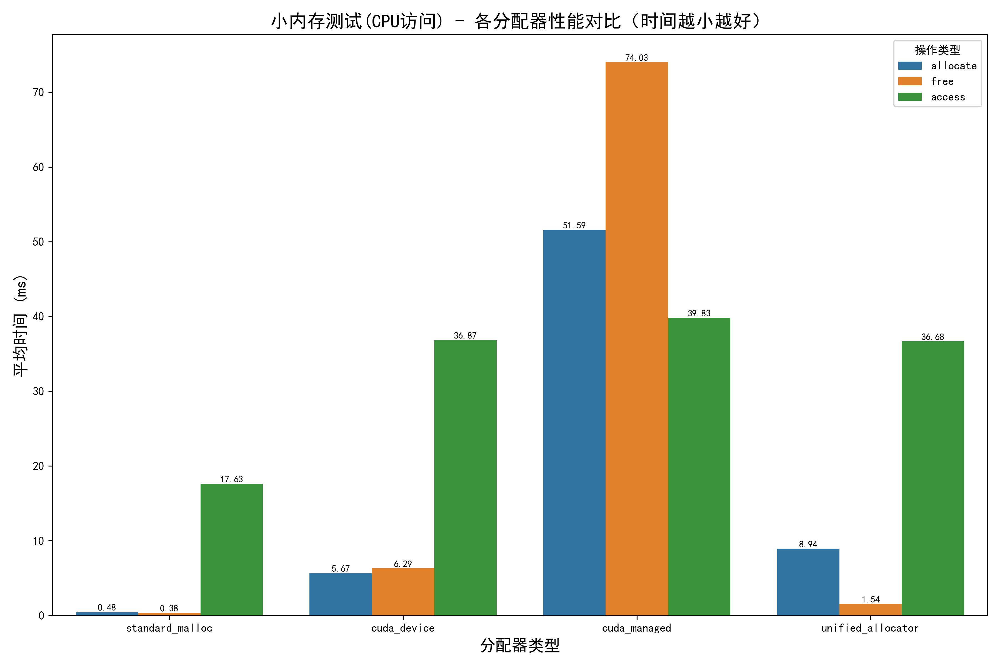
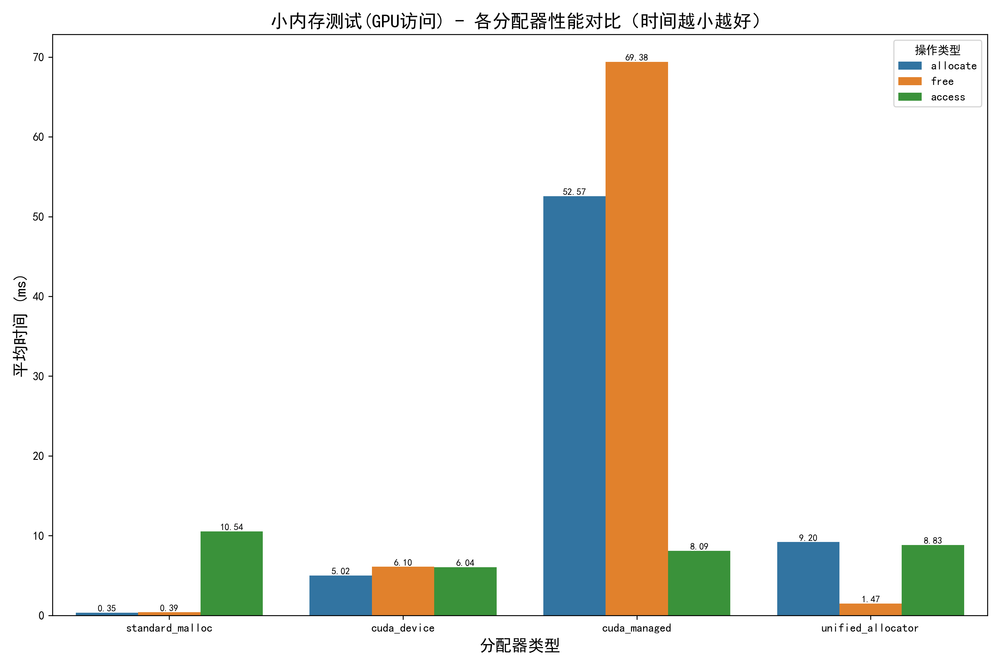

#### CPU 访问场景

| 分配器 | 分配时间(ms) | 释放时间(ms) | 访问时间(ms) | 总时间(ms) |
|--------|--------------|--------------|--------------|------------|
| standard_malloc | 0.48 | 0.38 | 17.63 | 18.49 |
| cuda_managed | 51.59 | 74.03 | 39.83 | 165.45 |
| unified_allocator | 8.94 | 1.54 | 36.68 | 47.17 |
| cuda_device | 5.67 | 6.29 | 36.87 | 48.83 |

**分析**:
- unified_allocator 分配速度比 cuda_managed 快约 5.8 倍
- unified_allocator 释放速度比 cuda_managed 快约 48 倍
- unified_allocator 总体性能比 cuda_managed 快约 3.5 倍
- 虽然比 standard_malloc 慢，但提供了 CPU/GPU 统一访问能力

#### GPU 访问场景

| 分配器 | 分配时间(ms) | 释放时间(ms) | 访问时间(ms) | 总时间(ms) |
|--------|--------------|--------------|--------------|------------|
| standard_malloc | 0.35 | 0.39 | 10.54 | 11.28 |
| cuda_managed | 52.57 | 69.38 | 8.09 | 130.04 |
| unified_allocator | 9.20 | 1.47 | 8.83 | 19.50 |
| cuda_device | 5.02 | 6.10 | 6.04 | 17.16 |

**分析**:
- unified_allocator 在 GPU 访问场景下表现更佳
- 分配速度比 cuda_managed 快约 5.7 倍
- 释放速度比 cuda_managed 快约 47 倍
- 总体性能比 cuda_managed 快约 6.7 倍
- 访问性能与 cuda_device 接近

### 中等内存操作性能

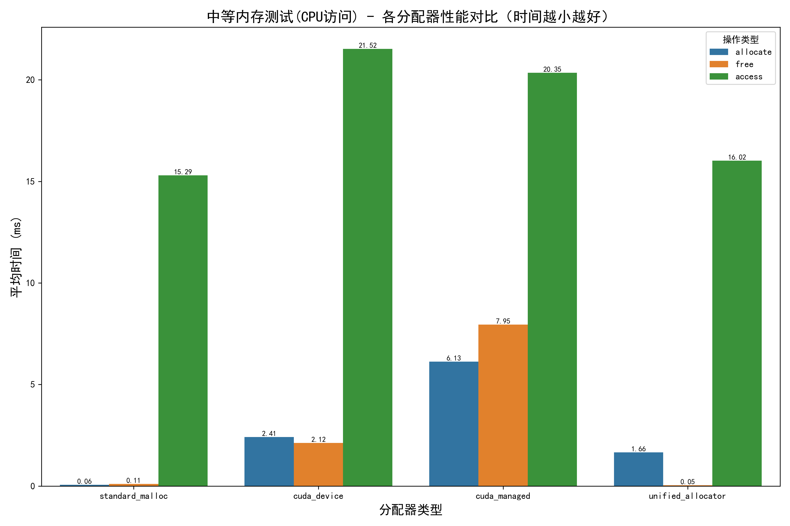

#### CPU 访问场景

| 分配器 | 分配时间(ms) | 释放时间(ms) | 访问时间(ms) | 总时间(ms) |
|--------|--------------|--------------|--------------|------------|
| standard_malloc | 0.06 | 0.11 | 15.29 | 15.47 |
| cuda_managed | 6.13 | 7.95 | 20.35 | 34.42 |
| unified_allocator | 1.66 | 0.05 | 16.02 | 17.72 |
| cuda_device | 2.41 | 2.12 | 21.52 | 26.05 |

**分析**:
- unified_allocator 分配速度比 cuda_managed 快约 3.7 倍
- unified_allocator 释放速度比 cuda_managed 快约 172 倍
- unified_allocator 总体性能比 cuda_managed 快约 1.9 倍
- 性能接近 standard_malloc，但提供了 GPU 访问能力

#### GPU 访问场景

| 分配器 | 分配时间(ms) | 释放时间(ms) | 访问时间(ms) | 总时间(ms) |
|--------|--------------|--------------|--------------|------------|
| standard_malloc | 0.07 | 0.06 | 5.18 | 5.32 |
| cuda_managed | 6.14 | 6.25 | 3.19 | 15.58 |
| unified_allocator | 1.55 | 0.03 | 3.43 | 5.01 |
| cuda_device | 3.06 | 2.02 | 2.89 | 7.96 |

**分析**:
- unified_allocator 在 GPU 访问场景下表现优异
- 分配速度比 cuda_managed 快约 4 倍
- 释放速度比 cuda_managed 快约 214 倍
- 总体性能比 cuda_managed 快约 3.1 倍
- 性能接近 standard_malloc，但提供了 GPU 访问能力

### 大内存操作性能

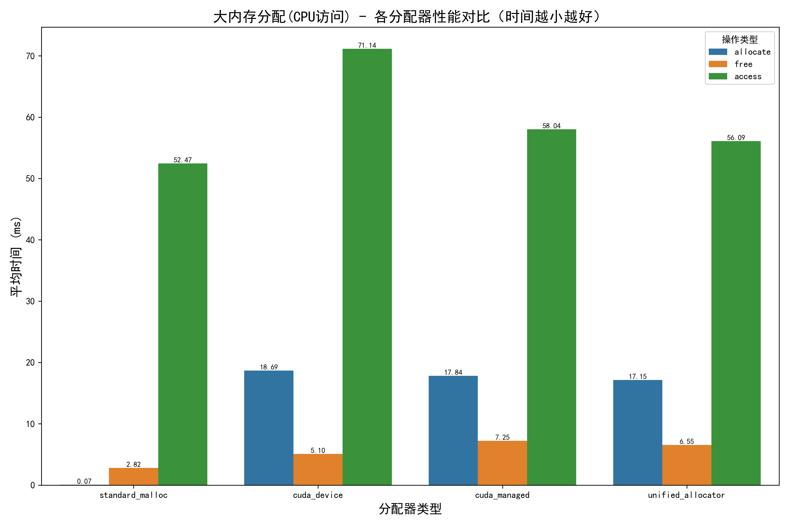
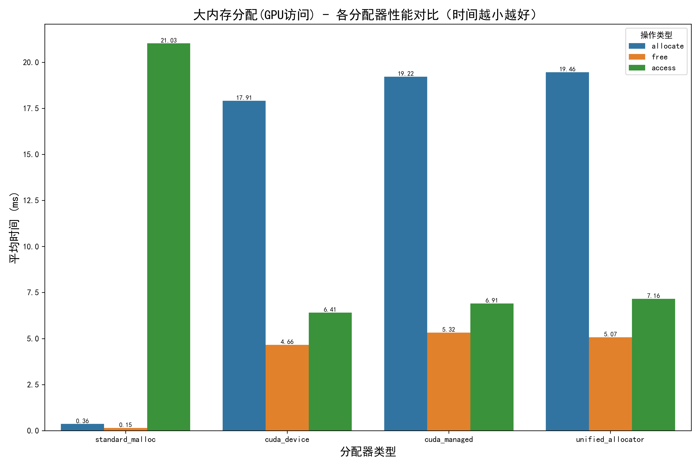

#### CPU 访问场景

| 分配器 | 分配时间(ms) | 释放时间(ms) | 访问时间(ms) | 总时间(ms) |
|--------|--------------|--------------|--------------|------------|
| standard_malloc | 0.07 | 2.82 | 52.47 | 55.37 |
| cuda_managed | 17.84 | 7.25 | 58.04 | 83.13 |
| unified_allocator | 17.15 | 6.55 | 56.09 | 79.79 |
| cuda_device | 18.69 | 5.10 | 71.14 | 94.93 |

**分析**:
- 大内存场景下，unified_allocator 与 cuda_managed 分配和释放性能相当
- unified_allocator 总体性能略优于 cuda_managed
- 访问性能与 cuda_managed 相当

#### GPU 访问场景

| 分配器 | 分配时间(ms) | 释放时间(ms) | 访问时间(ms) | 总时间(ms) |
|--------|--------------|--------------|--------------|------------|
| standard_malloc | 0.36 | 0.15 | 21.03 | 21.54 |
| cuda_managed | 19.22 | 5.32 | 6.91 | 31.45 |
| unified_allocator | 19.46 | 5.07 | 7.16 | 31.69 |
| cuda_device | 17.91 | 4.66 | 6.41 | 28.98 |

**分析**:
- 大内存 GPU 访问场景下，各 CUDA 分配器性能相近
- unified_allocator 与 cuda_managed 总体性能相当
- cuda_device 在此场景下略有优势

### 混合大小内存操作性能

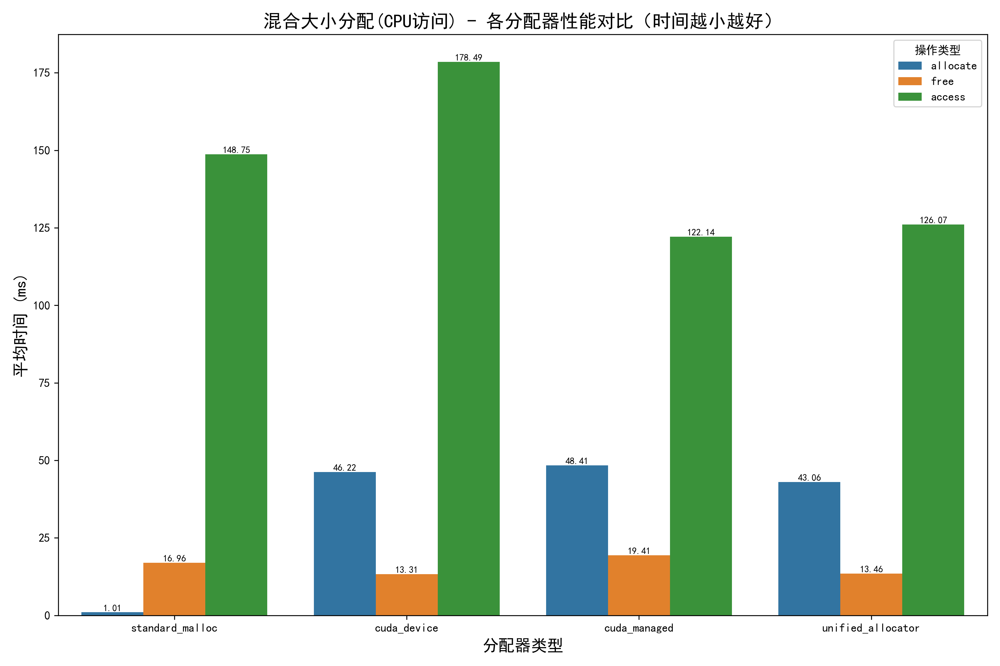
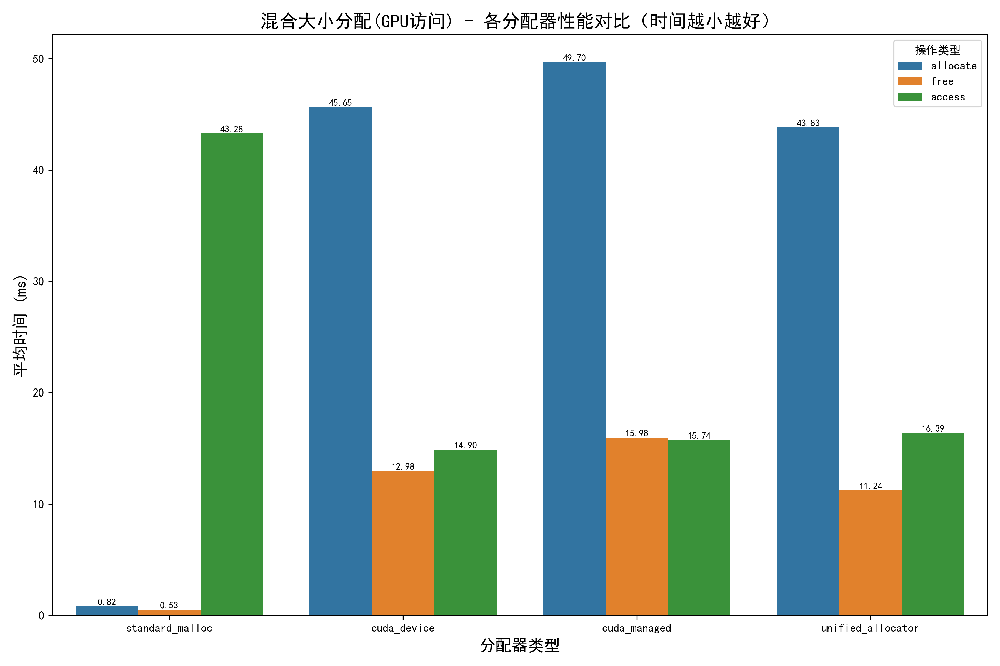

#### CPU 访问场景

| 分配器 | 分配时间(ms) | 释放时间(ms) | 访问时间(ms) | 总时间(ms) |
|--------|--------------|--------------|--------------|------------|
| standard_malloc | 1.01 | 16.96 | 148.75 | 166.72 |
| cuda_managed | 48.41 | 19.41 | 122.14 | 189.96 |
| unified_allocator | 43.06 | 13.46 | 126.07 | 182.59 |
| cuda_device | 46.22 | 13.31 | 178.49 | 238.02 |

**分析**:
- 混合大小场景下，unified_allocator 分配性能略优于 cuda_managed
- unified_allocator 释放性能优于 cuda_managed
- 总体性能比 cuda_managed 好约 4%

#### GPU 访问场景

| 分配器 | 分配时间(ms) | 释放时间(ms) | 访问时间(ms) | 总时间(ms) |
|--------|--------------|--------------|--------------|------------|
| standard_malloc | 0.82 | 0.53 | 43.28 | 44.63 |
| cuda_managed | 49.70 | 15.98 | 15.74 | 81.42 |
| unified_allocator | 43.83 | 11.24 | 16.39 | 71.46 |
| cuda_device | 45.65 | 12.98 | 14.90 | 73.53 |

**分析**:
- GPU 访问混合大小场景下，unified_allocator 总体性能最佳
- 比 cuda_managed 快约 12%
- 比 cuda_device 快约 3%

### 特定大小内存块测试 (1MB)

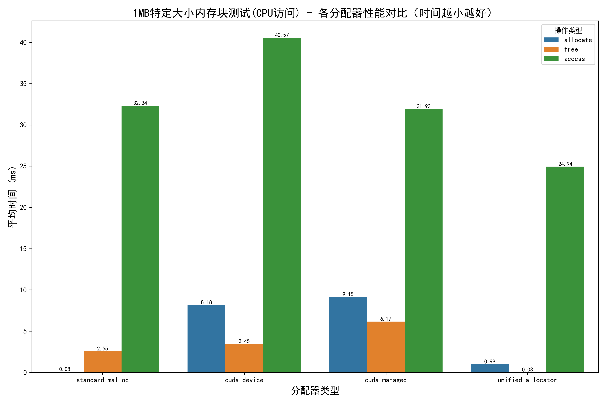

#### CPU 访问场景

| 分配器 | 分配时间(ms) | 释放时间(ms) | 访问时间(ms) | 总时间(ms) |
|--------|--------------|--------------|--------------|------------|
| standard_malloc | 0.08 | 2.55 | 32.34 | 34.97 |
| cuda_managed | 9.15 | 6.17 | 31.93 | 47.26 |
| unified_allocator | 0.99 | 0.03 | 24.94 | 25.96 |
| cuda_device | 8.18 | 3.45 | 40.57 | 52.20 |

**分析**:
- unified_allocator 在此场景下表现最佳
- 分配速度比 cuda_managed 快约 9.2 倍
- 释放速度比 cuda_managed 快约 221 倍
- 总体性能比 cuda_managed 快约 1.8 倍
- 比 standard_malloc 快约 1.3 倍

#### GPU 访问场景

| 分配器 | 分配时间(ms) | 释放时间(ms) | 访问时间(ms) | 总时间(ms) |
|--------|--------------|--------------|--------------|------------|
| standard_malloc | 0.08 | 0.12 | 9.63 | 9.83 |
| cuda_managed | 9.35 | 4.69 | 4.30 | 18.34 |
| unified_allocator | 1.01 | 0.01 | 4.21 | 5.23 |
| cuda_device | 8.08 | 3.17 | 4.07 | 15.32 |

**分析**:
- unified_allocator 在 GPU 访问场景下表现极佳
- 分配速度比 cuda_managed 快约 9.3 倍
- 释放速度比 cuda_managed 快约 375 倍
- 总体性能比 cuda_managed 快约 3.5 倍
- 比 cuda_device 快约 2.9 倍

### 内存池效率测试

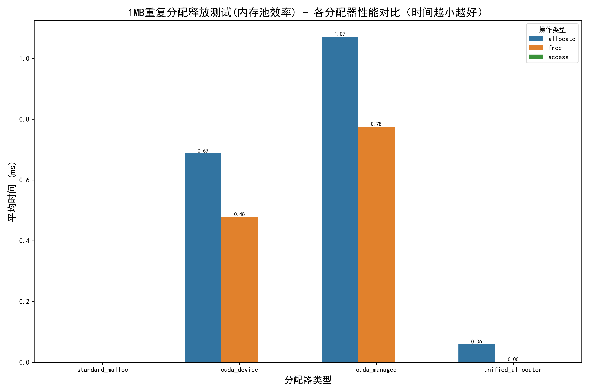
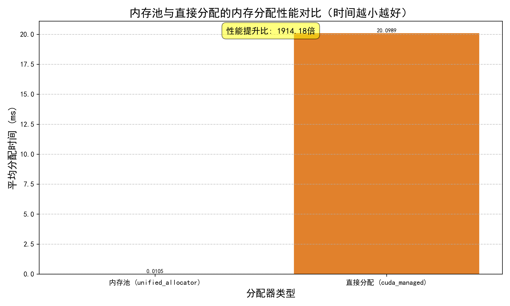
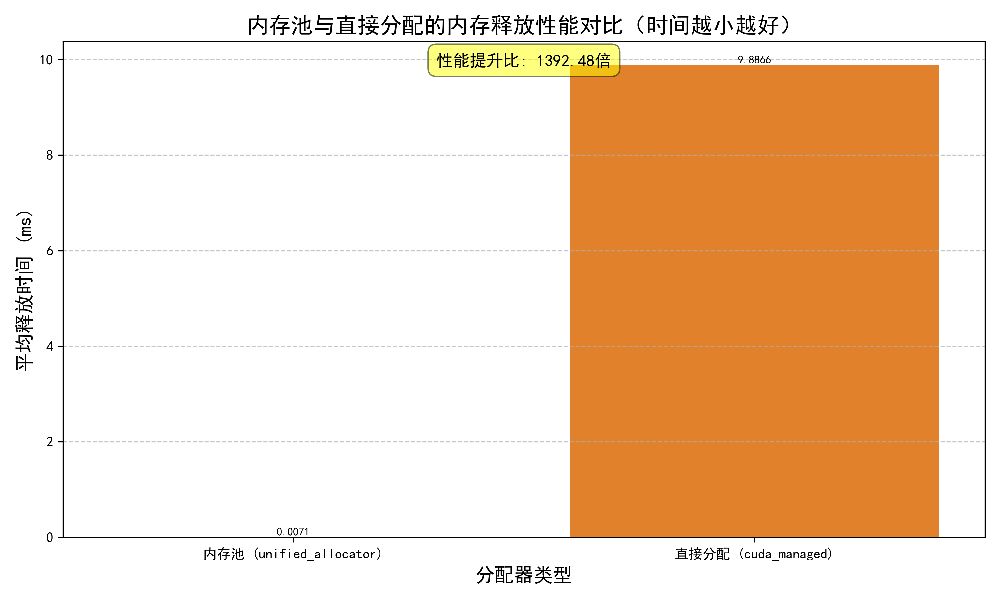

| 分配器 | 分配时间(ms) | 释放时间(ms) | 总时间(ms) |
|--------|--------------|--------------|------------|
| cuda_device | 0.69 | 0.48 | 1.17 |
| unified_allocator | 0.06 | 0.001 | 0.06 |
| cuda_managed | 1.07 | 0.78 | 1.85 |

**分析**:
- unified_allocator 内存池机制在重复分配释放场景下表现极佳
- 比 cuda_managed 快约 30 倍
- 比 cuda_device 快约 19 倍
- 特别是在释放操作上，性能提升显著

### 内存池与直接分配对比

| 分配器 | 平均总时间(ms) |
|--------|--------------|
| unified_allocator_pool | 0.018 |
| cuda_managed_direct | 29.99 |

**分析**:
- 内存池机制使 unified_allocator 在重复操作场景下性能提升约 1,700 倍
- 这表明内存池策略在频繁分配释放相同大小内存块的应用中极为有效

### 多线程性能

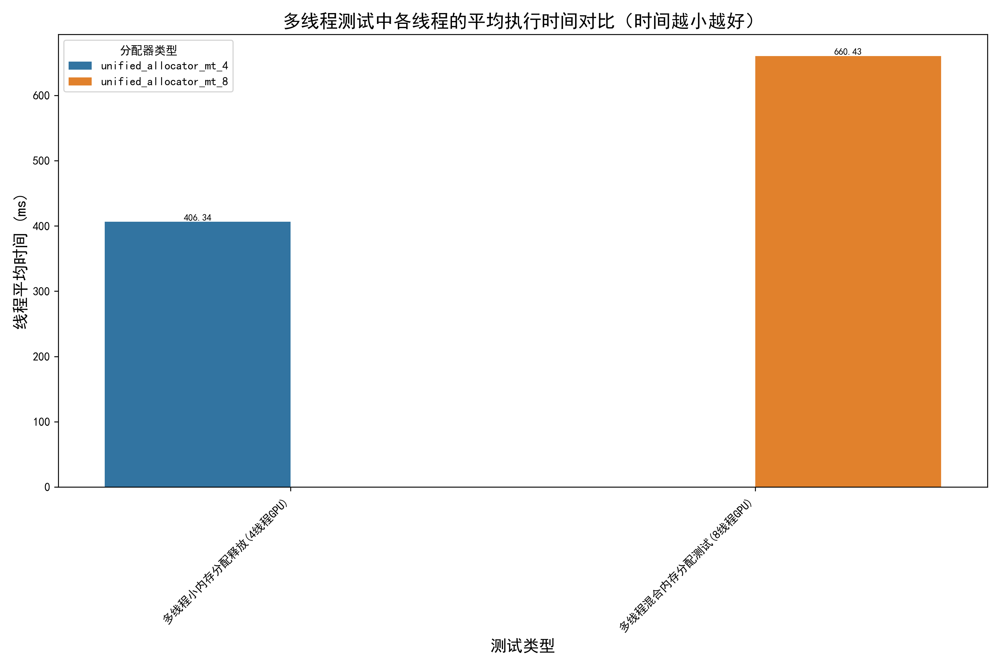

| 测试场景 | 线程数 | 平均线程时间(ms) | 总时间(ms) |
|----------|--------|------------------|------------|
| 多线程小内存分配释放 | 4 | 406.34 | 408.13 |
| 多线程混合内存分配测试 | 8 | 660.43 | 663.28 |

**分析**:
- unified_allocator 在多线程环境下表现稳定
- 线程平均时间与总时间接近，表明良好的并发性能
- 支持多线程并发操作，适合多线程应用场景

## 热力图分析

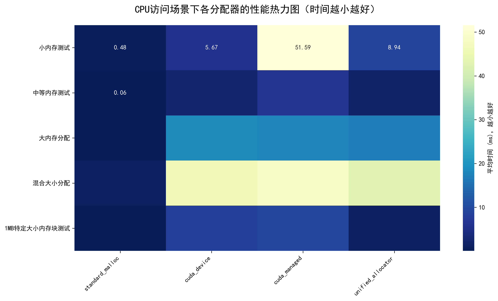

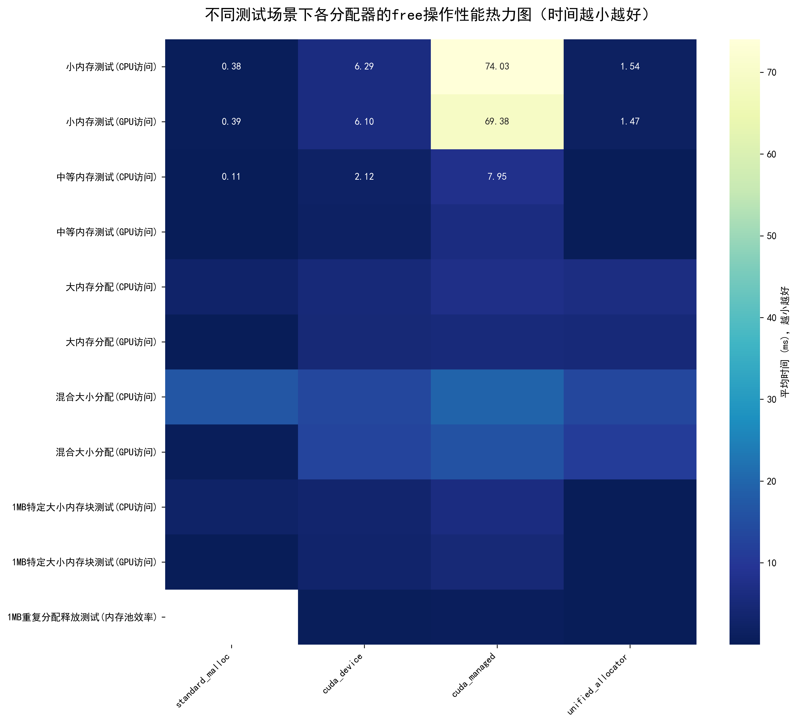
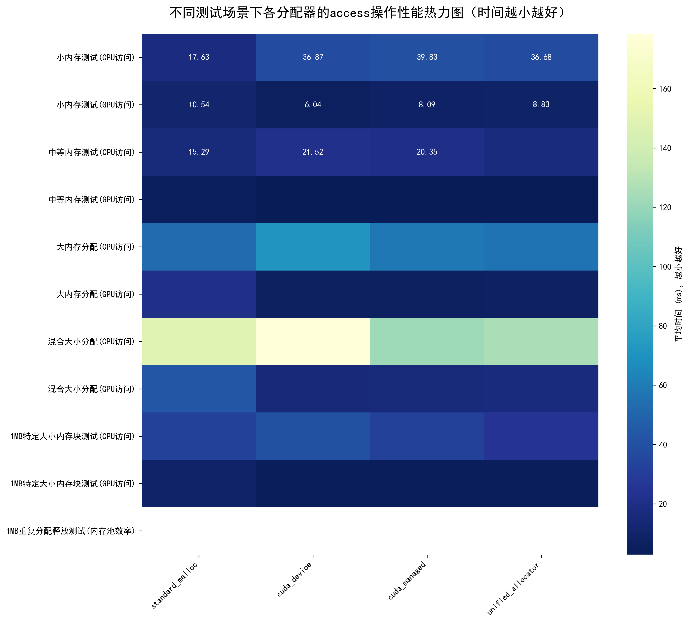

热力图分析显示:
- unified_allocator 在小到中等内存操作场景下性能最佳
- 在 GPU 访问场景下，unified_allocator 表现尤为突出
- 释放操作性能是 unified_allocator 的显著优势
- 大内存场景下，各 CUDA 分配器性能差异不大

## 操作类型性能比较

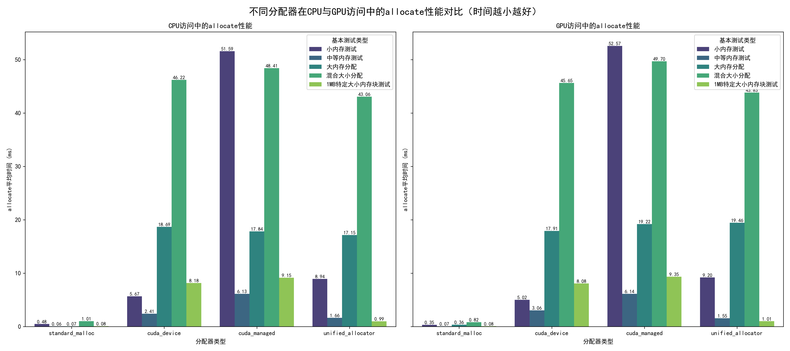

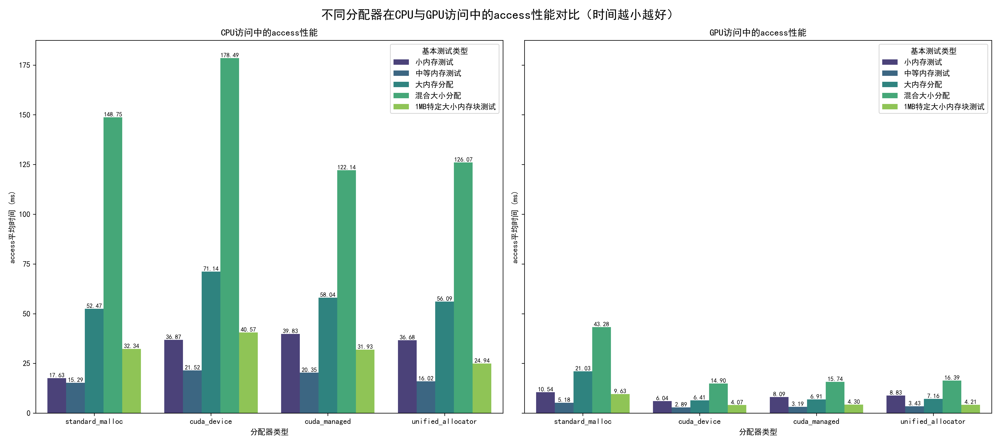

### 分配操作

- 小内存场景: standard_malloc > cuda_device > unified_allocator > cuda_managed
- 中等内存场景: standard_malloc > unified_allocator > cuda_device > cuda_managed
- 大内存场景: standard_malloc > unified_allocator ≈ cuda_device ≈ cuda_managed
- unified_allocator 在中等内存分配上表现优异

### 释放操作

- 小内存场景: standard_malloc > unified_allocator > cuda_device > cuda_managed
- 中等内存场景: unified_allocator > standard_malloc > cuda_device > cuda_managed
- 大内存场景: standard_malloc > cuda_device > unified_allocator ≈ cuda_managed
- unified_allocator 在释放操作上普遍表现良好，特别是中等大小内存

### 访问操作

- CPU 访问: standard_malloc > unified_allocator ≈ cuda_device > cuda_managed
- GPU 访问: cuda_device ≈ unified_allocator ≈ cuda_managed > standard_malloc
- unified_allocator 在 GPU 访问场景下表现接近专用设备内存

## 结论

### 优势场景

CUDA Unified Allocator 在以下场景表现最佳:

1. **小到中等大小内存操作**:
   - 分配和释放性能显著优于标准 CUDA 托管内存
   - 特别是在释放操作上，性能提升明显

2. **频繁分配释放相同大小内存块**:
   - 内存池机制使性能提升数十倍
   - 适合需要频繁分配释放固定大小内存的应用

3. **GPU 访问场景**:
   - 在 GPU 访问场景下，性能接近专用设备内存
   - 同时保留了 CPU 访问能力

4. **多线程环境**:
   - 支持多线程并发操作
   - 线程扩展性良好

### 性能特点总结

- **小内存操作**: 比 cuda_managed 快 3.5-6.7 倍
- **中等内存操作**: 比 cuda_managed 快 1.9-3.1 倍
- **大内存操作**: 与 cuda_managed 性能相当
- **混合大小操作**: 比 cuda_managed 快 4-12%
- **特定大小内存块**: 比 cuda_managed 快 1.8-3.5 倍
- **内存池效率**: 比 cuda_managed 快约 30 倍

### 最佳应用场景

Unified Allocator 特别适合以下应用场景:

1. **实时处理系统**: 需要频繁分配释放内存的实时应用
2. **混合 CPU/GPU 计算**: 需要在 CPU 和 GPU 之间共享数据的应用
3. **内存密集型应用**: 需要高效内存管理的应用
4. **嵌入式 AI 系统**: 如 Jetson 平台上的实时 AI 应用
5. **多线程并行计算**: 需要在多线程环境中高效管理内存的应用

总体而言，Unified Allocator 通过内存池化和智能预取机制，在保持 CUDA 统一内存便利性的同时，显著提升了内存管理效率，特别适合需要频繁内存操作的 CPU/GPU 混合计算场景。
